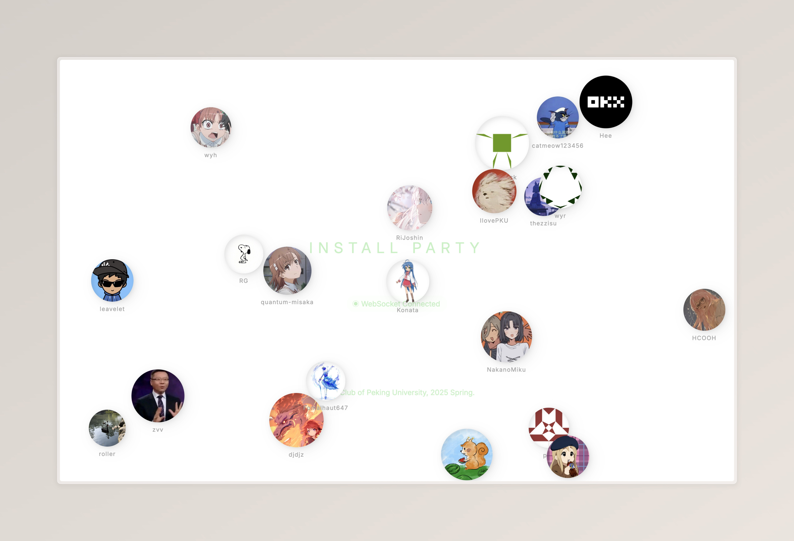

# Install Party Bubbles



## Deploy

### Client

```sh
cd client
bun install
bun run build
```

### Server

```sh
cd server
bun install
bun run build
```

### Configure Web Hooks

`POST` web hooks to `${SERVER}:3141/api/repository-pushed`

### Start Server

```sh
./server-bundle
caddy start
```
